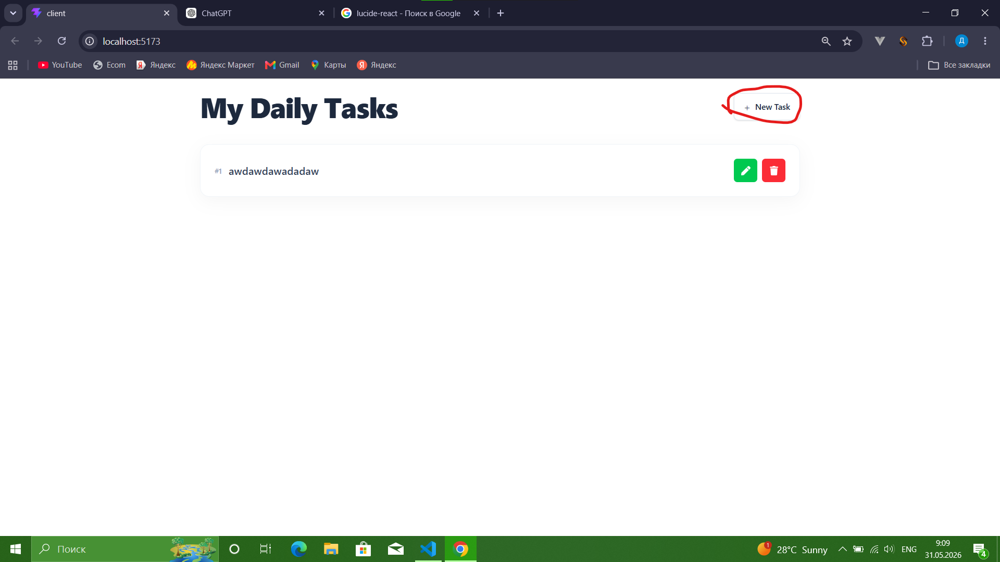
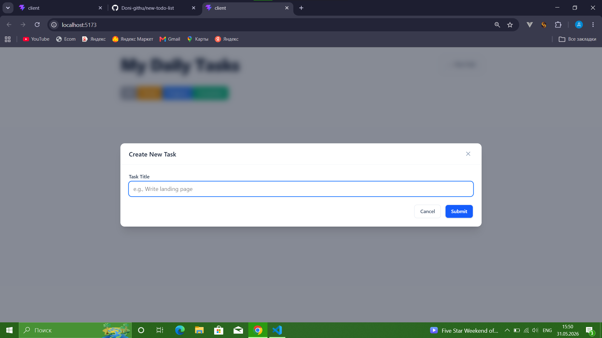
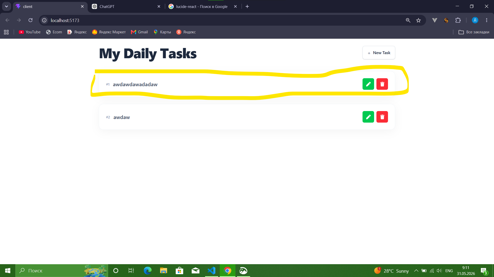
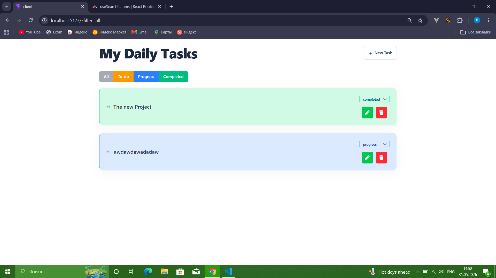
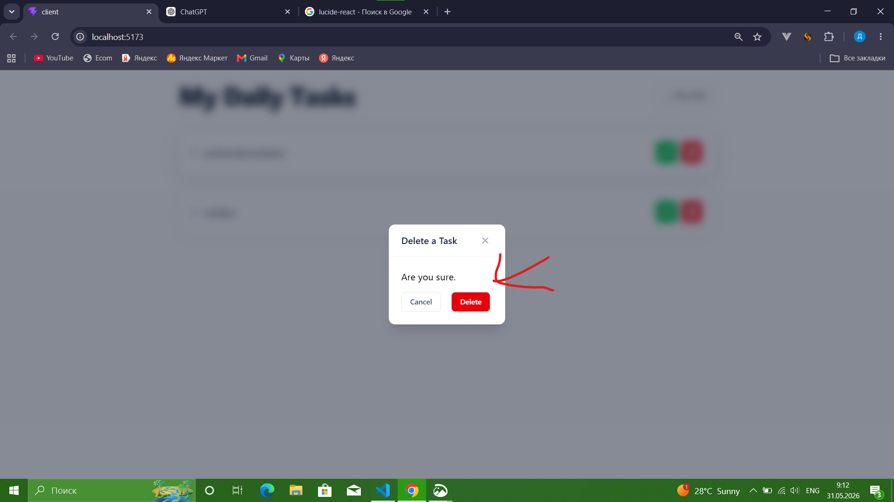

# My Daily Tasks

Welcome to **My Daily Tasks**! This is a simple and clean task manager app built with **React**, **TypeScript**, **Vite**, and **TailwindCSS**. It helps you organize your daily tasks, add new ones, edit them, and delete them. It's a fun and easy way to stay productive and on top of your to-do list!

---

## Features

- **Add New Tasks**: Quickly add tasks with a title and status.
- **Edit Tasks**: Update your task titles with ease.
- **Delete Tasks**: Remove tasks you no longer need.
- **Task Sorting**: Tasks are sorted automatically based on their status.
- **Favorite Tasks**: Mark tasks as favorites to prioritize them.

---

## How to Install

1. Clone this repository to your local machine:
   ```bash
   git clone https://github.com/your-username/todolist.git
   ```

2. Navigate to the **server** folder and install dependencies:
   ```bash
   cd server
   npm install
   ```

3. Create a `.env` file in the **server** folder and add the following:
   ```
   PORT=3000
   MONGODB_URI=your_mongodb_connection_string
   ```

4. Start the server:
   ```bash
   npm run dev
   ```

5. Open a new terminal, navigate to the **client** folder, and install dependencies:
   ```bash
   cd ../client
   npm install
   ```

6. Start the client:
   ```bash
   npm run dev
   ```

7. Open your browser and go to `http://localhost:5173` to see the app in action!

---

## How It Works

### Adding a Task
1. Click the **New Task** button.
   
2. A modal will pop up. Enter your task title and click **Submit**.
   

### Viewing Tasks
- Your tasks will appear in a neat list, sorted by their status. Here's how it looks:
  

### Editing a Task
1. Click the **Edit** button (green pencil icon) next to the task you want to edit.
   
2. Update the task title and press **Enter** to save your changes.

### Deleting a Task
1. Click the **Delete** button (red trash icon) next to the task you want to delete.
   
2. Confirm the deletion in the modal that pops up.

---

## Tech Stack

- **Frontend**: React, TypeScript, Vite, TailwindCSS
- **Backend**: Node.js, Express.js, MongoDB
- **HTTP Client**: Axios

```
Thanks for checking out **My Daily Tasks**! 
```